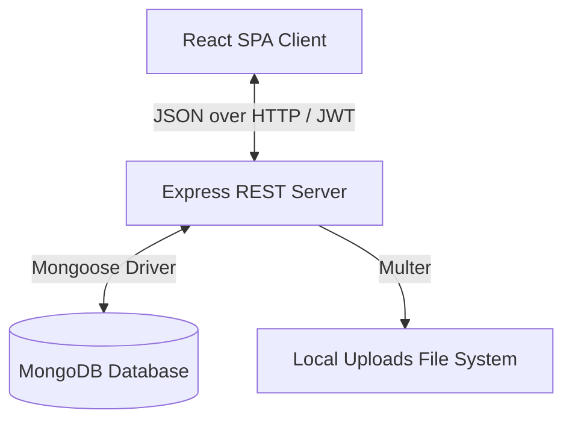
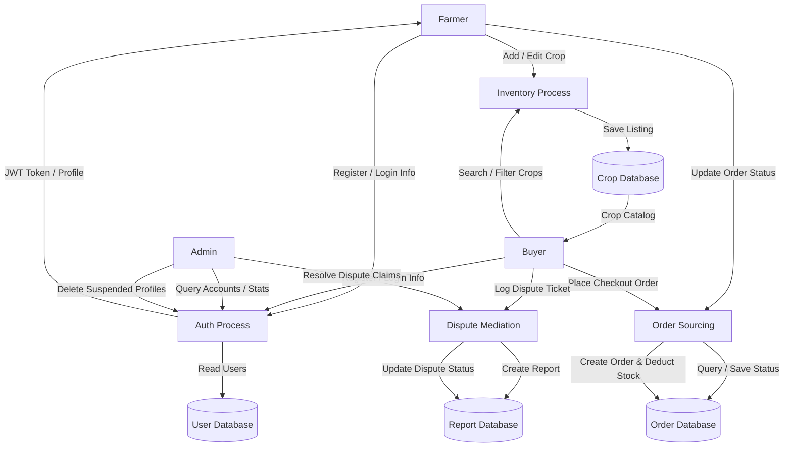

# Software Requirements Specification (SRS) for KisanSetu

## 1. Introduction

### 1.1 Purpose
This document specifies the software requirements for the KisanSetu platform, a direct farmer-to-buyer agritech marketplace designed to disintermediate supply chains, enforce secure role authorization, and provide direct sourcing.

### 1.2 Scope
KisanSetu consists of a Node.js/Express.js REST API backend connected to a MongoDB database, and a React.js single-page web app built with Tailwind CSS. It supports crop inventories, checkout carts, visual order trackers, local upload systems, and dispute mediators.

### 1.3 Definitions & Abbreviations
* **JWT:** JSON Web Token (used for encrypted stateless session identification).
* **GMV:** Gross Merchandise Volume (total invoice transactions value on the platform).
* **RBAC:** Role-Based Access Control (restricting system pages based on client credentials).
* **MSP:** Minimum Support Price.

---

## 2. Product Description

### 2.1 Product Perspective
KisanSetu is a standalone agricultural business application. It operates under a classic Client-Server layout.

### 2.2 User Classes & Characteristics
1. **Farmer:** Rural growers listing harvest crops, setting prices, managing stock quantities, uploading images, and modifying received shipment states.
2. **Buyer:** Procurement leads who browse lists, filter by locations, adjust quantities in checkout shopping bags, and trace visual progress steppers.
3. **Admin:** Platform moderators checking metrics, suspending users, and resolving disputes.

---

## 3. System Features & Capabilities

### 3.1 Authentication & Security (JWT)
* **FR-1:** Users must register with Name, Email, Phone, Location, Password, and Role selection.
* **FR-2:** Passwords must be dynamically salted and hashed (using `bcryptjs`) before saving to database.
* **FR-3:** Authenticated users receive signed JWT tokens for persistent sessions.

### 3.2 Farmer Listing Management
* **FR-4:** Verified farmers must be able to list crops with categories (`Grains`, `Vegetables`, `Fruits`, `Pulses`, `Oilseeds`), quantities, prices, descriptions, and locations.
* **FR-5:** Farmers must be able to upload crop image files, stored in a public local server uploads folder.
* **FR-6:** Farmers must be able to update crop specifications or delete listings.

### 3.3 Buyer Checkout & Ordering
* **FR-7:** Buyers must be able to search crops and filter catalogs by category tags or locations.
* **FR-8:** Buyers must be able to save crop listings in local checkout carts.
* **FR-9:** Checking out a cart must deduct stock levels dynamically from the Crop inventory and create corresponding pending orders.

### 3.4 Shipping Progress Tracker
* **FR-10:** Buyers and Farmers must see a multi-stage shipment progress tracker (Pending ➜ Approved ➜ Shipped ➜ Delivered).
* **FR-11:** Farmers must update states as shipments move from the farm, and buyers must be able to file dispute tickets on delivered orders.

### 3.5 Admin Mediation Panel
* **FR-12:** Admin must see overall platform counters (Total users, active crops, Gross Sales GMV, pending cases).
* **FR-13:** Admin must be able to delete users, automatically clearing associated crop listings and transaction records recursively.
* **FR-14:** Admin must be able to resolve or dismiss dispute tickets.

---

## 4. Data Flow Diagram (DFD)

The following Level 1 Data Flow Diagram maps how data moves between stakeholders and the central databases:

---

## 5. Non-Functional Requirements

### 5.1 Security
* All API endpoints (except login, register, and public crop catalogs) must require token authorization headers.
* Data payloads must be scrubbed using Mongoose schema validation.

### 5.2 Performance & Responsiveness
* REST API responses must resolve in under 200ms in sandbox environments.
* Frontend layout must load immediately utilizing light SVG components.

### 5.3 Reliability & Database Cascades
* Order cancellations must return stock back to crop inventories to prevent database discrepancies.
* Deleting a user must perform a cascading delete of all their listings to prevent orphaned records.

### 5.4 Usability & Accessibility
* Responsive design must wrap tables and grids into stacked flows on mobile devices.
* Standard colors must match agricultural palettes (deep emerald greens, rich ambers).
